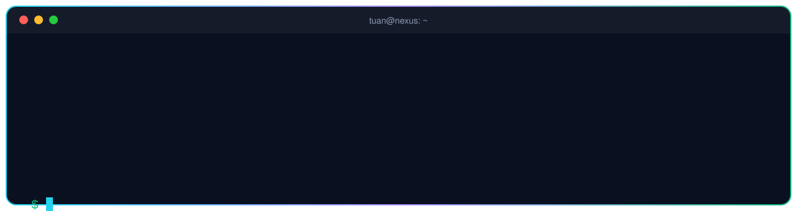
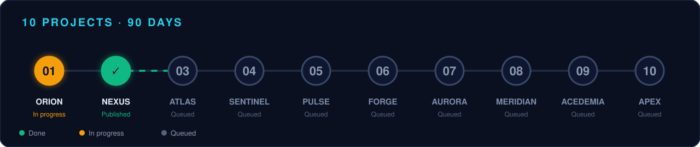

<picture>
  <source media="(prefers-color-scheme: dark)" srcset="https://raw.githubusercontent.com/ahsan-aflal-dev/github-readme-stats/refs/heads/master/dark.svg?v=1">
  <source media="(prefers-color-scheme: light)" srcset="https://raw.githubusercontent.com/ahsan-aflal-dev/github-readme-stats/refs/heads/master/light.svg?v=1">
  
</picture>

 

 

  

 

## 🚀 Featured Projects

<table>
<tr>
<td width="33%" align="center" valign="top">

</td>
<td width="33%" align="center" valign="top">

</td>
<td width="33%" align="center" valign="top">

</td>
</tr>
</table>

  

## 🗓️ 10 Projects in 90 Days

<b>View the full project list</b>

 

| # | Project | Status |
|:-:|---|---|
| 01 | **ORION** | 🟡 In progress |
| 02 | **NEXUS** | 🟢 Built, documented & published |
| 03 | ATLAS | ⚪ Queued |
| 04 | SENTINEL | ⚪ Queued |
| 05 | PULSE | ⚪ Queued |
| 06 | FORGE | ⚪ Queued |
| 07 | AURORA | ⚪ Queued |
| 08 | MERIDIAN | ⚪ Queued |
| 09 | ACEDEMIA | ⚪ Queued |
| 10 | APEX | ⚪ Queued |

## 🛠️ Tech Stack

## 📊 GitHub Stats

  

  
  

  

<picture>
  <source media="(prefers-color-scheme: dark)" srcset="https://raw.githubusercontent.com/ahsan-aflal-dev/ahsan-aflal-dev/output/github-snake-dark.svg" />
  <source media="(prefers-color-scheme: light)" srcset="https://raw.githubusercontent.com/ahsan-aflal-dev/ahsan-aflal-dev/output/github-snake.svg" />
  
</picture>

## 📫 Let's Connect

&nbsp;&nbsp;

&nbsp;&nbsp;

  

